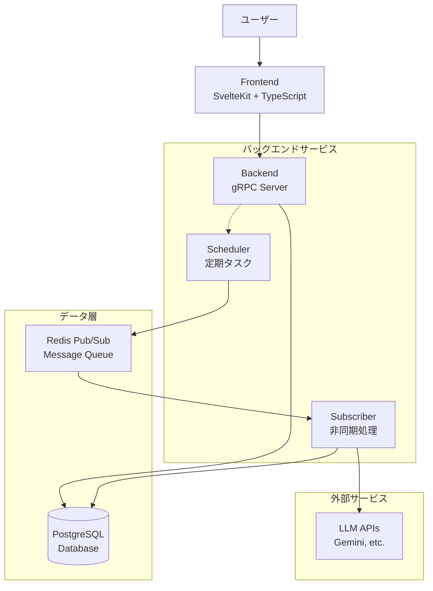

# umi.mikan

<div align="center">
  
</div>

**umi.mikan** はシンプルなWeb日記アプリです。

外部LLMを用いたまとめ機能もあります。

# ユーザ向け

compose-prod.example.yamlを参考にセルフホスティングしてお使いいただけます。

コンテナはarm64とamd64向けにbuildされています。

# 開発向け

## アーキテクチャ



### システムコンポーネント

| コンポーネント    | 技術                                                   | 目的                   |
| ----------------- | ------------------------------------------------------ | ---------------------- |
| **Frontend**      | SvelteKit + TypeScript + PWA                           | WebUI（PWA対応）       |
| **Backend**       | Go + gRPC                                              | 認証とAPIサーバ        |
| **Scheduler**     | Go                                                     | 要約の定期ディスパッチ |
| **Subscriber**    | Go + Redis                                             | 要約の非同期生成       |
| **Database**      | PostgreSQL 17                                          | 日記保存               |
| **Message Queue** | Redis Pub/Sub                                          | 重たい処理の非同期実行 |
| **Monitoring**    | Prometheus + Grafana + Loki + Grafana Alloy + cAdvisor | Pub/Subやログの監視    |

### データフロー

1. **ユーザー操作**: Frontend ↔ Backend (gRPC)
2. **データ永続化**: Backend → Database
3. **非同期処理**: Scheduler → Redis → Subscriber
4. **AI 処理**: Subscriber → LLM APIs → Database
5. **PWA機能**: Service Worker → キャッシュ → オフライン対応

### サービスアーキテクチャ

#### 非同期処理フロー

1. Scheduler が自動要約有効ユーザーを特定（5分毎）
2. 欠落した日次/月次要約のタスクを生成（今日/今月を除く）
3. Redis `diary_events` チャンネルに JSON メッセージを公開
4. Subscriber がメッセージを消費し LLM APIs 経由で処理
5. 生成された要約をデータベースに保存

#### PWA（プログレッシブウェブアプリ）機能

- **自動更新**: Service Worker による自動アップデート通知
- **オフライン対応**: キャッシュされた日記の閲覧が可能
- **インストール**: ホーム画面への追加とアプリライクな体験
- **レスポンシブ**: 様々なデバイスサイズに対応
- **アイコン**: 8サイズ（72px〜512px）のアプリアイコン
- **キャッシュ戦略**: NetworkFirst でAPI呼び出しを最適化

## 技術スタック

### バックエンド

- **言語**: Go 1.25
- **通信**: gRPC (prootoを元にbackend,frontendのコードを自動生成)
- **ORM**: schema/の定義を元にxoで自動生成

### フロントエンド

- **フレームワーク**: SvelteKit
- **言語**: TypeScript 5
- **スタイリング**: Tailwind CSS 4
- **i18n**: svelte-i18n（日本語/英語）
- **format/lint**: Biome
- **PWA**: @vite-pwa/sveltekit によるプログレッシブウェブアプリ対応

### インフラ

- **コンテナ**: Docker + Docker Compose
- **DB**: PostgreSQL 17
- **キャッシュ/キュー**: Redis 8
- **監視**: Prometheus + Grafana + Loki + Grafana Alloy + cAdvisor

## はじめに

### インストール

dockerさえあれば動くはず

### 実行

```bash
dc up -d
```

### 開発URL

- **アプリケーション**: http://localhost:2000（Frontend）
- **監視**: http://localhost:2008（Grafana Dashboard）

#### 詳細

| サービス               | ポート | URL                           | 説明                              |
| ---------------------- | ------ | ----------------------------- | --------------------------------- |
| **Frontend**           | 2000   | http://localhost:2000         | SvelteKit 開発サーバー            |
| **Backend**            | 2001   | http://localhost:2001         | gRPC API サーバー                 |
| **PostgreSQL**         | 2002   | localhost:2002                | メインデータベース                |
| **PostgreSQL Test**    | 2003   | localhost:2003                | テストデータベース                |
| **Redis**              | 2004   | localhost:2004                | Pub/Sub メッセージキュー          |
| **Subscriber Metrics** | 2005   | http://localhost:2005/metrics | Prometheus メトリクス             |
| **Scheduler Metrics**  | 2006   | http://localhost:2006/metrics | Prometheus メトリクス             |
| **Prometheus**         | 2007   | http://localhost:2007         | メトリクス収集ダッシュボード      |
| **Grafana**            | 2008   | http://localhost:2008         | 監視ダッシュボード（admin/admin） |
| **cAdvisor**           | 2009   | http://localhost:2009         | コンテナメトリクス収集            |
| **Loki**               | 2010   | http://localhost:2010         | ログ集約システム                  |
| **Grafana Alloy**      | 2011   | http://localhost:2011         | ログ収集エージェント              |

### 開発コマンド

#### フロントエンド

```bash
make f-format      # Biome でコードフォーマット
make f-lint        # リントとフォーマットチェック
make f-test        # フロントエンドテスト実行
make f-log         # フロントエンドログ表示
make f-sh          # フロントエンドコンテナアクセス
```

#### バックエンド

```bash
make b-format      # gofmt と golangci-lint で Go コードフォーマット
make b-lint        # リント実行
make b-test        # バックエンドテスト実行
make b-log         # バックエンドログ表示
make b-sh          # バックエンドコンテナアクセス
make tidy          # go mod tidy 実行
```

#### DB

```bash
make db            # PostgreSQL 接続
make db-diff       # schema/とのスキーマ差分表示
make db-apply      # schema/とのスキーマ変更適用
make xo            # dbを元にbackendのコードを生成
```

#### gRPC

```bash
make grpc          # proto/を元にGoとTypeScript両方のgRPC コード生成
```

#### gRPC デバッグ

```bash
grpc_cli ls localhost:2001                                           # サービス一覧
grpc_cli ls localhost:2001 diary.DiaryService -l                     # サービス詳細
grpc_cli type localhost:2001 diary.CreateDiaryEntryRequest           # メッセージタイプ表示
grpc_cli call localhost:2001 DiaryService.CreateDiaryEntry 'title: "test",content:"test"'  # テスト呼び出し
grpc_cli call localhost:2001 DiaryService.SearchDiaryEntries 'userID:"id" keyword:"%日記%"'  # エントリ検索
```
