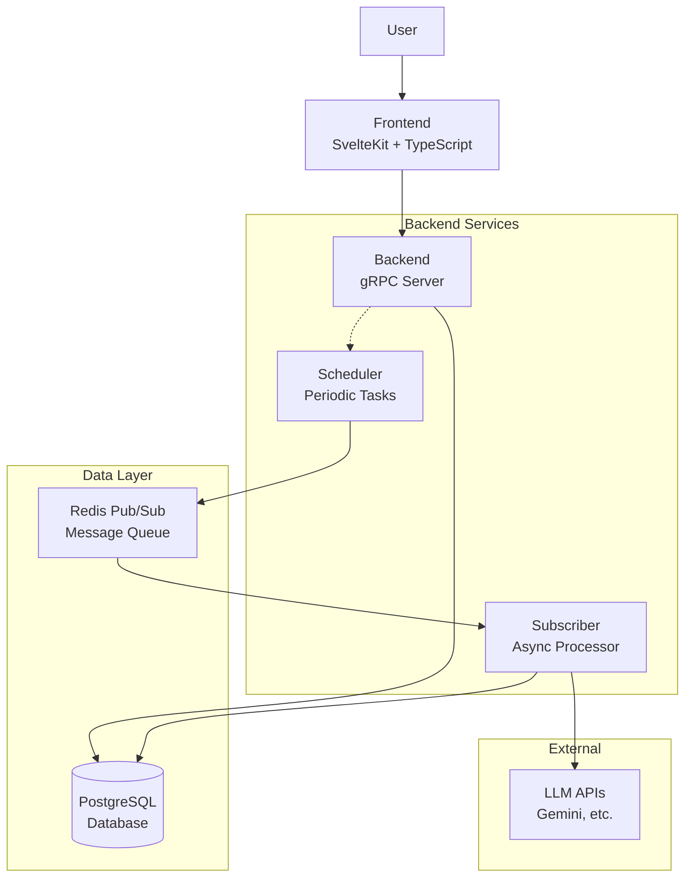

# umi.mikan

**umi.mikan** is a full-stack diary application with automated AI summary generation.

## Architecture



### System Components

| Component | Technology | Purpose |
|-----------|------------|---------|
| **Frontend** | SvelteKit + TypeScript | User interface, diary management |
| **Backend** | Go + gRPC | API server, authentication, data access |
| **Scheduler** | Go + Cron | Periodic task execution, summary scheduling |
| **Subscriber** | Go + Redis | Async processing, LLM integration |
| **Database** | PostgreSQL 17 | Data persistence, user accounts, diary entries |
| **Test Database** | PostgreSQL 17 | Isolated testing environment |
| **Message Queue** | Redis Pub/Sub | Async job queuing, inter-service communication |
| **Distributed Lock** | Redis + Lua Scripts | Prevents duplicate task execution across instances |
| **Monitoring** | Prometheus + Grafana | Metrics collection and visualization |

### Data Flow

1. **User Interaction**: Frontend ↔ Backend (gRPC)
2. **Data Persistence**: Backend → Database
3. **Async Processing**: Scheduler → Redis → Subscriber
4. **AI Processing**: Subscriber → LLM APIs → Database

### Service Architecture

The application follows a microservices architecture with async processing capabilities:

#### Core Services
- **Frontend**: SvelteKit-based UI with TypeScript and Tailwind CSS
- **Backend**: Go gRPC server handling API requests and authentication
- **Scheduler**: Periodic task runner for automated summary generation
- **Subscriber**: Async worker processing LLM tasks

#### Infrastructure
- **Database**: PostgreSQL for persistent data storage (separate test DB)
- **Message Queue**: Redis Pub/Sub for async communication
- **Distributed Locking**: Redis-based locks with Lua scripts for task coordination
- **Authentication**: JWT-based with refresh token mechanism
- **Monitoring**: Prometheus metrics with Grafana dashboards
- **Hot Reload**: Air for backend, Vite for frontend development

#### Async Processing Flow
1. Scheduler identifies users with auto-summary enabled (every 5 minutes)
2. Generates tasks for missing daily/monthly summaries (excluding today/current month)
3. Publishes JSON messages to Redis `diary_events` channel
4. Subscriber consumes messages and processes via LLM APIs
5. Generated summaries saved back to database

## Tech Stack

### Backend
- **Language**: Go 1.25
- **Framework**: gRPC
- **Database**: PostgreSQL 17
- **Authentication**: JWT (15min access + 30day refresh)
- **Architecture**: Clean Architecture
- **Hot Reload**: Air
- **Code Generation**: Protocol Buffers, XO (database models)
- **Message Queue**: Redis Pub/Sub with rueidis client

### Frontend
- **Framework**: SvelteKit
- **Language**: TypeScript
- **Styling**: Tailwind CSS
- **Component Architecture**: Atomic Design
- **Internationalization**: svelte-i18n (Japanese/English)
- **Code Quality**: Biome (formatting/linting)

### Infrastructure
- **Containerization**: Docker + Docker Compose
- **Database**: PostgreSQL 17 (main + test instances)
- **Cache/Queue**: Redis 8 Alpine with persistence
- **Monitoring Stack**: Prometheus + Grafana with custom dashboards
- **Deployment**: Multi-stage Docker builds for production
- **Development Tools**: Hot reload (Air/Vite), code generation (protoc/XO)

## Getting Started

### install

```bash
sudo pacman -S protobuf
```

メモ：go toolにしたいがdockerの外なので悩ましい

```bash
go install google.golang.org/protobuf/cmd/protoc-gen-go@latest
go install google.golang.org/grpc/cmd/protoc-gen-go-grpc@latest
```

```bash
npm install -g @grpc/proto-loader
```

### run

```bash
dc up -d
```

#### Service URLs

| Service | Port | URL | Description |
|---------|------|-----|-------------|
| **Frontend** | 2000 | http://localhost:2000 | SvelteKit development server |
| **Backend** | 2001 | http://localhost:2001 | gRPC API server |
| **PostgreSQL** | 2002 | localhost:2002 | Main database |
| **PostgreSQL Test** | 2003 | localhost:2003 | Test database |
| **Redis** | 2004 | localhost:2004 | Pub/Sub message queue |
| **Subscriber Metrics** | 2005 | http://localhost:2005/metrics | Prometheus metrics |
| **Scheduler Metrics** | 2006 | http://localhost:2006/metrics | Prometheus metrics |
| **Prometheus** | 2007 | http://localhost:2007 | Metrics collection dashboard |
| **Grafana** | 2008 | http://localhost:2008 | Monitoring dashboard (admin/admin) |

#### Key Access Points
- **Application**: http://localhost:2000 (Frontend)
- **API**: http://localhost:2001 (Backend gRPC)
- **Monitoring**: http://localhost:2008 (Grafana Dashboard)

### Development Commands

#### Frontend Development
```bash
make f-format      # Format code with Biome
make f-lint        # Lint and format check
make f-test        # Run frontend tests
make f-log         # View frontend logs
make f-sh          # Access frontend container
```

#### Backend Development
```bash
make b-format      # Format Go code with gofmt and golangci-lint
make b-lint        # Run linting
make b-test        # Run backend tests
make b-log         # View backend logs
make b-sh          # Access backend container
make tidy          # Run go mod tidy
```

#### Database Operations
```bash
make db            # Connect to PostgreSQL
make xo            # Generate database models
make db-diff       # Show schema differences
make db-apply      # Apply schema changes
```

#### gRPC Development
```bash
make grpc          # Generate both Go and TypeScript gRPC code
make grpc-go       # Generate Go gRPC code only
make grpc-ts       # Generate TypeScript gRPC code only
```

#### gRPC Debugging
```bash
grpc_cli ls localhost:2001                                           # List services
grpc_cli ls localhost:2001 diary.DiaryService -l                     # Service details
grpc_cli type localhost:2001 diary.CreateDiaryEntryRequest           # Show message type
grpc_cli call localhost:2001 DiaryService.CreateDiaryEntry 'title: "test",content:"test"'  # Test call
grpc_cli call localhost:2001 DiaryService.SearchDiaryEntries 'userID:"id" keyword:"%日記%"'  # Search entries
```

### Monitoring & Observability

The application includes comprehensive monitoring through Prometheus and Grafana:

#### Metrics Available
- **Scheduler**: Job execution rates, duration, queued messages, auto-summary user counts
- **Subscriber**: Message processing rates, duration, summary generation counts
- **Success Rates**: Job execution and message processing success percentages

#### Accessing Monitoring
1. **Grafana Dashboard**: http://localhost:2008
   - Login: admin/admin
   - Dashboard: "umi.mikan Pub/Sub Monitoring"
2. **Prometheus**: http://localhost:2007
   - Raw metrics and query interface
3. **Individual Metrics**:
   - Scheduler: http://localhost:2006/metrics
   - Subscriber: http://localhost:2005/metrics
