# umi.mikan

**umi.mikan** is a full-stack diary application with automated AI summary generation.

## Architecture

```mermaid
graph TB
    %% User Interface
    User[👤 User] --> Frontend[🌐 Frontend<br/>SvelteKit + TypeScript]

    %% Core Services
    Frontend --> Backend[🚀 Backend<br/>gRPC Server]
    Backend --> DB[(🗄️ PostgreSQL<br/>Database)]

    %% Async Processing System
    Scheduler[⏰ Scheduler<br/>Periodic Tasks] --> Redis[📨 Redis Pub/Sub<br/>Message Queue]
    Redis --> Subscriber[🔄 Subscriber<br/>Async Processor]

    %% External Services
    Subscriber --> LLM[🤖 LLM APIs<br/>Gemini, etc.]

    %% Data Flow
    Backend -.-> Scheduler
    Subscriber --> DB

    %% Service Details
    subgraph "Backend Services"
        Backend
        Scheduler
        Subscriber
    end

    subgraph "Data Layer"
        DB
        Redis
    end

    subgraph "External"
        LLM
    end

    %% Styling
    classDef frontend fill:#e1f5fe
    classDef backend fill:#f3e5f5
    classDef data fill:#fff3e0
    classDef external fill:#e8f5e8

    class Frontend frontend
    class Backend,Scheduler,Subscriber backend
    class DB,Redis data
    class LLM external
```



### System Components

| Component | Technology | Purpose |
|-----------|------------|---------|
| **Frontend** | SvelteKit + TypeScript | User interface, diary management |
| **Backend** | Go + gRPC | API server, authentication, data access |
| **Scheduler** | Go + Cron | Periodic task execution, summary scheduling |
| **Subscriber** | Go + Redis | Async processing, LLM integration |
| **Database** | PostgreSQL 17 | Data persistence, user accounts, diary entries |
| **Message Queue** | Redis Pub/Sub | Async job queuing, inter-service communication |

### Data Flow

1. **User Interaction**: Frontend ↔ Backend (gRPC)
2. **Data Persistence**: Backend → Database
3. **Async Processing**: Scheduler → Redis → Subscriber
4. **AI Processing**: Subscriber → LLM APIs → Database

### Service Architecture

The application follows a microservices architecture with async processing capabilities:

#### Core Services
- **Frontend**: SvelteKit-based UI with TypeScript and Tailwind CSS
- **Backend**: Go gRPC server handling API requests and authentication
- **Scheduler**: Periodic task runner for automated summary generation
- **Subscriber**: Async worker processing LLM tasks

#### Infrastructure
- **Database**: PostgreSQL for persistent data storage
- **Message Queue**: Redis Pub/Sub for async communication
- **Authentication**: JWT-based with refresh token mechanism

#### Async Processing Flow
1. Scheduler identifies users with auto-summary enabled (every 5 minutes)
2. Generates tasks for missing daily/monthly summaries (excluding today/current month)
3. Publishes JSON messages to Redis `diary_events` channel
4. Subscriber consumes messages and processes via LLM APIs
5. Generated summaries saved back to database

## Tech Stack

### Backend
- **Language**: Go 1.25
- **Framework**: gRPC
- **Database**: PostgreSQL 17
- **Authentication**: JWT (15min access + 30day refresh)
- **Architecture**: Clean Architecture
- **Hot Reload**: Air
- **Code Generation**: Protocol Buffers, XO (database models)
- **Message Queue**: Redis Pub/Sub with rueidis client

### Frontend
- **Framework**: SvelteKit
- **Language**: TypeScript
- **Styling**: Tailwind CSS
- **Component Architecture**: Atomic Design
- **Internationalization**: svelte-i18n (Japanese/English)
- **Code Quality**: Biome (formatting/linting)

### Infrastructure
- **Containerization**: Docker + Docker Compose
- **Database**: PostgreSQL 17
- **Cache/Queue**: Redis 8 Alpine
- **Deployment**: Multi-stage Docker builds for production

## Getting Started

### install

```bash
sudo pacman -S protobuf
```

メモ：go toolにしたいがdockerの外なので悩ましい

```bash
go install google.golang.org/protobuf/cmd/protoc-gen-go@latest
go install google.golang.org/grpc/cmd/protoc-gen-go-grpc@latest
```

```bash
npm install -g @grpc/proto-loader
```

### run

```bash
dc up -d
```

- Backend：http://localhost:8080
- Frontend：http://localhost:5173

### debug

サービス一覧

```bash
grpc_cli ls localhost:8080
```

詳細

```basrh
grpc_cli ls localhost:8080 diary.DiaryService -l
```

type表示

```bash
grpc_cli type localhost:8080 diary.CreateDiaryEntryRequest
```

remote call

```bash
grpc_cli call localhost:8080 DiaryService.CreateDiaryEntry 'title: "test",content:"test"'
```

日記検索

```bash
grpc_cli call localhost:8080 DiaryService.SearchDiaryEntries 'userID:"id" keyword:"%日記%"'
```
